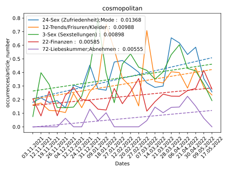

Web-scraper
---

# How to use

1. download the zip file
2. unzip the zip file in an empty folder or just pull the folder in the zip file in a folder.
3. open settings.json
   1. ``["https://www.elle.de/", "elle", false],``
      1. ``https://www.elle.de`` url to root site
      2. ``elle`` name of the site (you decide)
      3. ``false`` if it should use selenium ``true`` else ``false`` only use selenium if necessary
   2. ``"browser": "chrome"`` browser
      1. if you use chrome: ``"browser": "chrome"``
      2. if you use firefox: ``"browser": "firefox"``
   3. put it (if needed in the autostart)

If you run into any issues, open an issue in this GitHub page or write me a mail: Lars.Noack@outlook.de

Analysing the data
---

I use analyze the data from following sites (every other site is even more crap):
- bleib gesund
- cosmopolitan
- brigitte
- elle
- jolie

# data preparation for cluster analysis

## read raw data

The data is saved in a folder, where every sub folder is named a date. In the sub folder there are every data from a day.
For every available magazine one json file.

I am only reading the data of the above-mentioned magazines. I am returning this number with a custom iterator. Every iteration it returns a dictionary, 
where the keys are the names of the magazines and the value being the according content. It also returns the date in utc.

## keyword analysis

I am using [yake](https://pypi.org/project/yake/) to analyze 20 keywords from the body and 1 from the header, and returning it as sorted list, by importance.

The function to do so takes in a dictionary of the read data of a day, and some constants. It returns a dictionary where the key being again the magazines, 
and the values being a list containing a list containing all extracted keywords with the importance. 
Per article the list is sorted by importance and contains `KEYWORDS_PER_ARTICLE = 10` keywords.

``Note: The closer the importance of the keywords are, the more important it is.``

Due to the headers being less accurate, because yake can only extract keywords from larger texts well, 
I just multiply the importance of the keywords in the header by a factor of `HEADER_IMPORTANCE_FACTOR = 1.5`.

### filter out "index site"

There are some sites, just linking to other articles. To filter those out, I count the number of chars in the text and divide those with the number of chars in all headers. 
If this value is greater than `MIN_TEXT_HEADER_RATIO = 2`, then it is a real article.

## compute the edge weights

This is the final step of the first part. Here I prepare the data for the clustering. Therefore, I have to create a graph from the data.
The nodes represent one extracted keyword from the previous step. The edges represent the similarity between the keywords. 
The weight of the edge is the number of articles, where the keyword is mentioned.

I have two classes.

### class Node

It contains the name of the keyword, the number of articles for every connected keyword, and the importance. of every connected keyword. 
If I have an article, I add for every keyword in the according instance of Node for every other keyword a connection and increase the weights accordingly.

### class Magazine

This simply contains the name of the magazine, and the processes of creating and editing the nodes. I am creating one instance for every
magazine, and for all magazines.

I am creating a node for every keyword in the according magazine. Then for every article, where the keywords get passed in by main.py,
I add connections to according nodes.

At the End I am exporting the graphs as matrices for every magazine instance with [pandas](https://pandas.pydata.org/).

Then I can just import it into Gephi.

# cluster analysis with gephi

Because this analysis didn't end up good, I just used the magazine cosmopolitan. To analyze the data, I used [gephi](https://gephi.org/). First of I imported
matrix_cosmopolitan.csv into gephi. First I used the springload algorithm "forced atlas" on the graph, then I created a graph with the cosmopolitan data. I used the builtin community detection algorithm to find the communities.
After doing so, I colored the nodes according to the community, and exported the data as a csv file. I named it cosmopolitan_modularity.csv.

# trend analysis

## label all communities

Ok so now I have all communities, but no clue what they are about. But I have the Frequency of every keyword, and to which community
it belongs. So I first of load both data, and then I create a dictionary with the community as key and the keywords in a list as values.
The keywords are sorted by the frequency. Then I just pick n keywords and join them to a string, and I have a label. The problem
with it is, that it is never accurate. That's why I store it in a json file, and load it afterwards. The step bevorhand is 
optional, so you can manually name the communities.

## count the keywords

So the goal is, to have for every community, for every downloaded date, the number of times one keyword was mentioned in a distinct article.
If two keywords from the same community are mentioned in the same article, I count it only once. Due to a filter I might have applied in Gephi,
some articles can't be mapped to a community, but that neglectable. We are talking about like 40 out of 1.000 articles. So first of 
I create a dictionary with the community as key and another dict as values. The dict contains the date as key and the number of articles
containing minimum one keyword from this community. Then I iterate over every date and pass a list with every article, where every article is
a list of keywords to the function. After, I create for every community a new date. Then I iterate over every article of the date, 
and search for keywords, which are mapped to a community. Having found one, I remember, that I already found this community in particular article
and increment the value at the according community, at the according date.

## create a graph

After the step before, I have a dictionary, looking like this:
```python
{
    "community1": {
        "date1": 0,
        "date2": 2,
        "date3": 1
    },
    "community2": {
        "date1": 1,
        "date2": 1,
        "date3": 0
    }
}
```

This is a big simplification, but I don't go into detail.

I have two notable constants. First of the one saying, how many communitys should be shown. That's pretty self-explanatory.
The second one is the days to sum up. Due to the frequency of the appearances every day being maximum 3, I added tose of
a certain amount of days up. That creates data that makes more sense. I currently sum up 7 days.

Then I "just" draw the graph with matplotlib and read the file with the community labels. A graph like this can be seen below.


